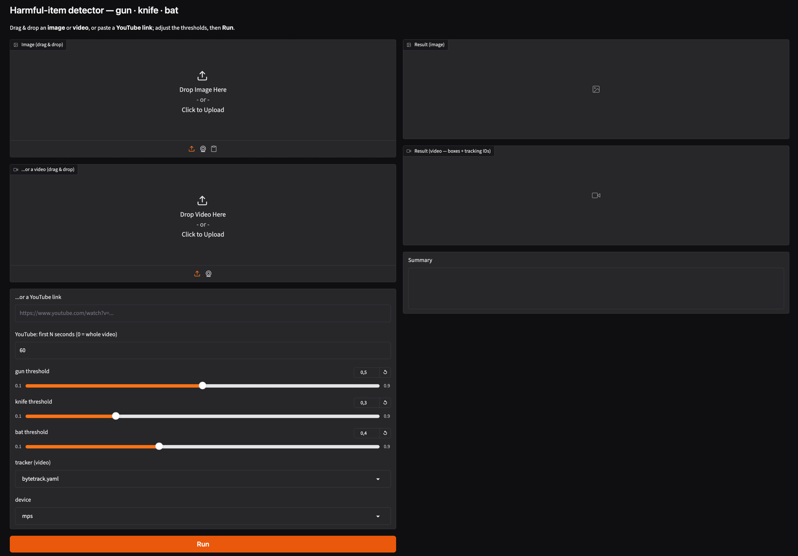

# harmful_detector

A 3-class dangerous-item detector — **gun · knife · bat** — built on YOLO.
The production model is `models/harmful_v3.pt` (YOLO11s, trained on Colab) and is
**included in this repo**, so inference works out of the box.



> The Gradio web app (`app.py`): drop an image/video or paste a YouTube link, tune the
> per-class confidence thresholds (gun / knife / bat), and hit **Run**.

## Quick start

All scripts run inside the conda env `harmful` (Python 3.12):

```bash
conda activate harmful          # or prefix each command with: conda run -n harmful

# Web GUI (drag-and-drop image / video / YouTube link)
python app.py                   # -> http://127.0.0.1:7860

# CLI inference
python src/predict.py path/to/video.mp4 --conf 0.3           # image / video / folder (supply your own)
python src/predict.py 0                                       # webcam (live window)
python src/track.py  <video>                                 # ByteTrack object IDs
python src/webcam.py                                          # low-latency webcam loop
python src/batch_videos.py                                    # batch a folder of videos
```

Classes: `0=gun`, `1=knife`, `2=bat`. Inference runs locally on Mac (MPS) — no Colab needed;
Colab GPU is only used for (re)training. See [`docs/cli_tools.md`](docs/cli_tools.md) for all
CLI scripts and their options.

## Layout

| Path           | Contents |
|----------------|----------|
| `app.py`       | Gradio web UI (entry point); per-class confidence thresholds + H.264 output |
| `models/`      | `harmful_v3.pt` (production, 3-class) — shipped; other weights are gitignored |
| `src/`         | inference (`predict`, `track`, `webcam`, `batch_videos`) + dataset builders |
| `configs/`     | dataset YAMLs — `dataset_v*.yaml` (local), `data_colab*.yaml` (Colab) |
| `docs/`        | `cli_tools.md` (CLI reference) + `how_it_works.md` (pipeline internals) |

## Known gaps

- **gun over-prediction** — training data is gun-dominant (gun 53% / knife 38% / bat 8%),
  so the model fires "gun" too eagerly. Mitigate with per-class thresholds; real fix = more
  knife/bat data + hard negatives.
- **weak kitchen-knife recall** — the knife class is combat-knife heavy (domain gap).
  Plan: top up with everyday/kitchen-knife data (e.g. HOD).

## Dataset

The v3 model was trained on a merged, de-duplicated 3-class dataset of **~18,600 images**:

| Split | Images | Boxes | gun | knife | bat |
|-------|-------:|------:|----:|------:|----:|
| Train | 15,789 | 14,995 | ~53% | ~38% | ~8%  |
| Val   |  2,818 |  2,323 | ~57% | ~33% | ~10% |

(Percentages are each class's share of boxes — the set is gun-dominant; see [Known gaps](#known-gaps).)

Sources, merged with average-hash de-duplication to prevent train/val leakage:

- **Haris weapon-detection (curated)** — base gun/knife set (~11,500 images, including ~2,780
  background / hard-negative images), used in place with its native train/val split.
- **SasankYadati guns** — +276 gun images (the survivors after de-duping against the curated set).
- **Zenodo "Dangerous Items"** (CC-BY 4.0) — adds the **bat** class plus extra gun/knife/machete;
  ~1,550 near-duplicates (~18% overlap) were dropped during the merge. The `bat` class comes
  only from here.

## Training

Done on Google Colab GPU (local MPS is too slow): **YOLO11s**, 640 px, 120 epochs, batch ≈ 33,
`cache=ram`, on an A100. Build the dataset with `src/build_dataset_v3.py`, package it for Colab
upload, then train with the config in `configs/data_colab_v3.yaml`. The data sources and
class-mapping table are documented in the `src/build_dataset*.py` docstrings.

## License

MIT — see [`LICENSE`](LICENSE).

## Attribution

The model was trained on third-party datasets, used under their respective licenses:

- **Haris weapon-detection dataset (curated)** — base gun/knife images.
- **Zenodo "Dangerous Items"** — record [16422779](https://doi.org/10.5281/zenodo.16422779),
  CC-BY 4.0 (provides the `bat` class and additional gun/knife/machete data).
- **SasankYadati gun dataset** — additional gun images.

Built with [Ultralytics YOLO](https://github.com/ultralytics/ultralytics).
